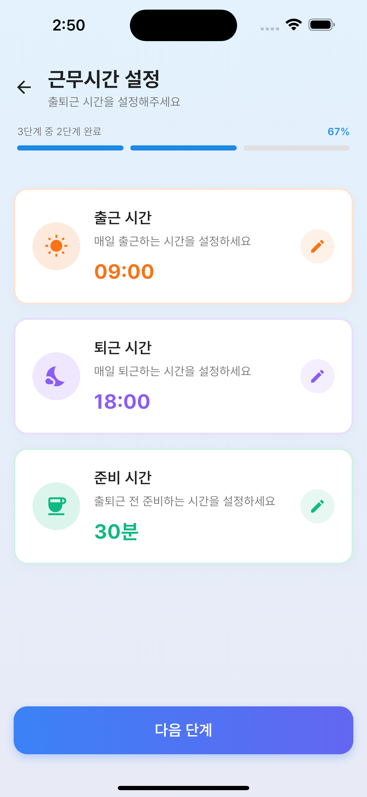

# 출퇴근타임 (Commute Time)

> 스마트한 출퇴근 경로 관리를 위한 Flutter 앱

[](https://flutter.dev)
[](https://dart.dev)
[](https://pub.dev/packages/get)

---

## 스크린샷

<table>
  <tr>
    <td></td>
    <td></td>
    <td></td>
  </tr>
  <tr>
    <td></td>
    <td></td>
    <td></td>
  </tr>
  <tr>
    <td></td>
    <td></td>
    <td></td>
  </tr>
</table>

---

## 프로젝트 소개

**출퇴근타임**은 서울/경기 지역의 대중교통(지하철, 버스)을 이용하는 직장인들을 위한 실시간 출퇴근 경로 관리 앱입니다.

### 주요 기능

- **실시간 교통 정보** - 지하철/버스 도착 정보 실시간 조회
- **경로 관리** - 출발지, 도착지, 환승지를 포함한 출퇴근 경로 저장 및 관리
- **날씨 정보** - 기상청 API 기반 현재 날씨 및 시간별 예보
- **개인화 설정** - 근무시간 및 알림 설정

---

## 주요 기능 상세

### **홈 화면**
- **실시간 경로 도착정보**
  - 출발지, 환승지, 도착지의 실시간 도착정보 표시
  - 지하철 호선별, 방면별 필터링
  - 서울/경기도 버스 실시간 도착정보
- **날씨 정보**
  - 현재 위치 기반 날씨 정보
  - 시간별 날씨 예보 (12시간)
  - 비 예보 분석 및 우산 알림
- **경로 새로고침** - 실시간 정보 수동 갱신

### **경로 설정**
- **출발지/도착지 검색**
  - 카카오 로컬 API 기반 장소 검색
  - 지하철역, 버스 정류장 통합 검색
  - 검색 결과에서 교통수단 선택
- **환승지 추가**
  - 최대 여러 개의 환승 정류장 설정
  - 호선 및 방면 선택
- **경로 저장 및 관리**
  - 여러 경로 저장 (집↔회사, 집↔학교 등)
  - 저장된 경로 선택 및 활성화
  - 경로별 이름 지정 가능

### **실시간 교통정보**
- **지하철**
  - 서울 지하철 1~9호선
  - 신분당선, 분당선, 경의중앙선, 공항철도, 경춘선 등
  - 호선별/방면별 실시간 도착정보
  - 열차 위치 및 도착 예정시간
- **버스**
  - 서울 시내버스 (간선/지선/광역/순환)
  - 경기도 시내버스 (일반/좌석/직행좌석/광역급행)
  - 정류장별 실시간 도착정보
  - 버스 위치 및 남은 정류장 수

### **설정**
- **알림 설정** - 출발 시간, 날씨 변화, 교통 장애 알림
- **근무시간 설정** - 출근/퇴근 시간 관리
- **테마 설정** - 라이트/다크 모드

---

## 기술 스택

### **Frontend**
- **Flutter 3.29+** - 크로스플랫폼 모바일 앱 프레임워크
- **Dart 3.0+** - 프로그래밍 언어
- **GetX 4.6+** - 상태관리, 라우팅, 의존성 주입

### **UI/UX**
- **Flutter ScreenUtil** - 반응형 디자인
- **Material Design 3** - 구글 디자인 시스템
- **Lottie** - 애니메이션

### **API & 서비스**
- **카카오 로컬 API** - 장소 검색 및 좌표 변환
- **기상청 단기예보 API** - 날씨 및 예보 정보
- **서울시 실시간 지하철 도착정보 API** - 지하철 도착 정보
- **공공데이터포털 버스 도착정보 API**
  - 서울 버스 도착정보 (cityCode 기반)
  - 경기도 버스 도착정보 (v2 API)

### **데이터 관리**
- **Get Storage** - 로컬 데이터 저장 (경로, 설정)
- **Geolocator** - GPS 위치 서비스
- **Geocoding** - 위도/경도 ↔ 주소 변환
- **HTTP** - RESTful API 통신
- **flutter_dotenv** - 환경변수 관리 (API 키)

---

## 프로젝트 구조

```
lib/
├── app/
│   ├── routes/                           # 앱 라우팅 (GetX Router)
│   │   ├── app_pages.dart               # 페이지 정의
│   │   └── app_routes.dart              # 라우트 경로
│   ├── services/                         # API 서비스
│   │   ├── weather_service.dart         # 기상청 날씨 API
│   │   ├── subway_service.dart          # 지하철 실시간 도착 API
│   │   ├── subway_search_service.dart   # 지하철 역 검색
│   │   ├── seoul_bus_service.dart       # 서울 버스 도착정보
│   │   ├── gyeonggi_bus_service.dart    # 경기도 버스 검색
│   │   ├── bus_arrival_service.dart     # 경기도 버스 도착정보
│   │   ├── bus_search_service.dart      # 버스 정류장 검색
│   │   ├── kakao_address_service.dart   # 카카오 주소 검색
│   │   ├── kakao_local_service.dart     # 카카오 로컬 검색
│   │   ├── map_search_service.dart      # 통합 장소 검색
│   │   └── location_service.dart        # GPS 위치
│   └── theme/                            # 앱 테마
│       └── app_theme.dart               # 테마 설정
├── screens/                              # 화면별 구조
│   ├── splash/                          # 스플래시 화면
│   ├── onboarding/                      # 온보딩 (초기 설정)
│   │   └── widgets/                     # 단계별 위젯
│   │       ├── step_route_setup.dart   # 경로 설정 단계
│   │       ├── step_work_time_setup.dart # 근무시간 설정
│   │       └── step_notification_setup.dart # 알림 설정
│   ├── main/                            # 메인 탭 컨테이너
│   ├── home/                            # 홈 화면 (실시간 정보)
│   ├── location_search/                 # 장소 검색
│   │   └── widgets/
│   │       └── transport_bottom_sheet.dart # 교통수단 선택 바텀시트
│   ├── route_setup/                     # 경로 설정 화면
│   ├── settings/                        # 설정 화면
│   ├── auth/                            # 인증 (로그인)
│   └── realtime/                        # 실시간 정보 화면
└── main.dart                            # 앱 진입점
```

---

## 시작하기

### 사전 요구사항
- Flutter SDK 3.29+
- Dart SDK 3.0+
- Android Studio / Xcode (플랫폼별)

---

## 주요 기능 구현 세부사항

### 실시간 도착정보 표시
- **지하철**: 호선별/방면별 필터링, 실시간 도착시간 업데이트
- **버스**: 서울/경기도 버스 구분, 정류장별 도착정보
- **자동 갱신**: 경로 변경 시 자동으로 도착정보 갱신
- **시각적 표시**: 색상 코드(호선별 색상), 아이콘, 도착 예정 시간

### 경로 저장 시스템
- **구조화된 데이터**: 출발지, 도착지, 환승지 정보를 Map 형태로 저장
- **메타데이터**: 교통수단 타입, 노선 정보, 정류장 코드 등 포함
- **버전 관리**: 구형식 데이터 마이그레이션 지원

### 날씨 정보
- **기상청 격자 좌표 변환**: 위도/경도를 기상청 격자 좌표로 변환
- **비 예보 분석**: 오늘의 강수 시간대 분석 및 조언 제공
- **위치 기반**: GPS 또는 저장된 위치 기반 날씨 조회

---

## 개발 및 디버깅

### 로그 확인
앱 실행 시 다음 로그로 동작을 확인할 수 있습니다:
- 출발지 도착정보 로딩 시작
- 지하철 도착정보 로딩 성공
- 필터링 적용
- 경기도 버스 v2 API 호출

### 주요 컨트롤러
- `HomeController`: 홈 화면 및 실시간 도착정보 관리
- `RouteSetupController`: 경로 설정 및 저장
- `LocationSearchController`: 장소 검색
- `MainTabController`: 탭 네비게이션

---

## 라이선스

이 프로젝트는 개인 학습 및 포트폴리오 목적으로 제작되었습니다.

---

## API 제공

- **공공데이터포털**: 기상청, 서울시, 경기도 공공 API
- **카카오 개발자센터**: 카카오 로컬 API